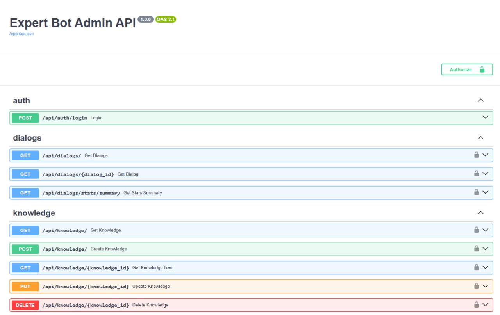
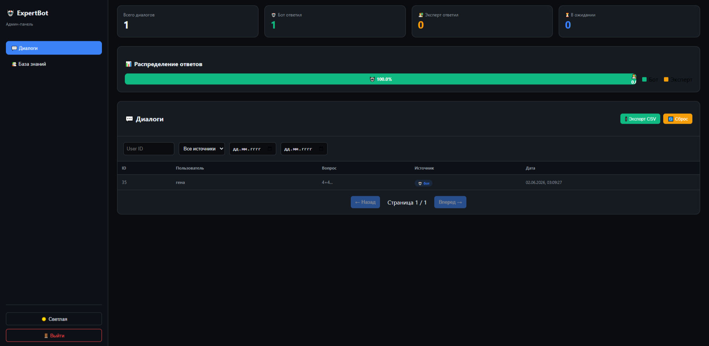
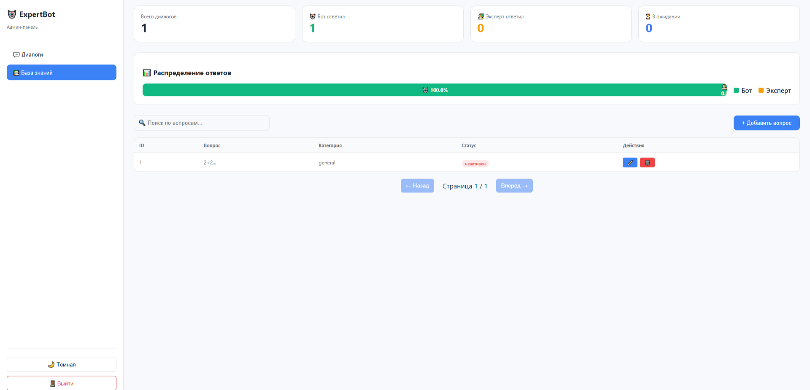
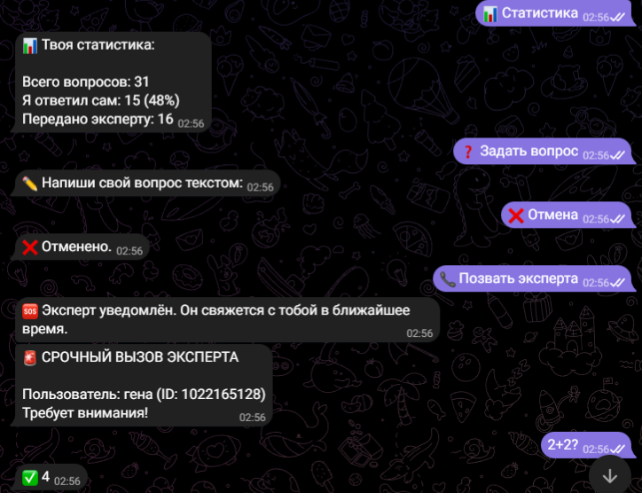
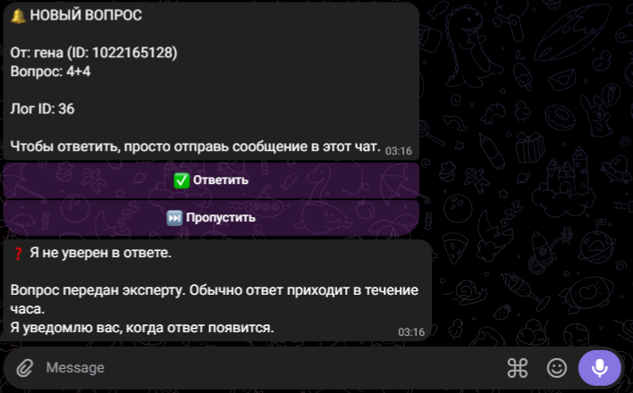

# ExpertBot — Telegram бот-эксперт c самообучением

## 📌 Задача бизнеса
Бизнесу требуется автоматический консультант в Telegram, который отвечает на часто задаваемые вопросы, обучается на ответах эксперта и не требует постоянного присутствия человека. При этом критически важны конфиденциальность данных (всё локально) и возможность управления базой знаний.

## 🛠 Что сделано
Разработана полностью автоматическая система Telegram-консультирования с человеко-машинным обучением:

| Модуль | Технологии | Что делает |
|--------|------------|------------|
| Telegram бот | python-telegram-bot / aiogram | Принимает вопросы, отправляет ответы |
| Генерация ответов | Ollama + Qwen 2.5 (локальная LLM) | Отвечает на вопросы пользователей |
| RAG (векторный поиск) | LanceDB + sentence-transformers | Ищет похожие вопросы в базе знаний |
| Эксперт (human-in-the-loop) | Telegram Bot API | Пересылает сложные вопросы эксперту |
| Хранение | PostgreSQL | Сохраняет историю диалогов и базу знаний |
| Админ-панель | React + TypeScript + FastAPI | Дашборд, управление знаниями, просмотр логов |
| Автоматизация | Docker + GitHub Actions | CI/CD, авто-тесты при каждом пуше |
| Установка | START.ps1 / START.bat (одна команда) | Автоматически настраивает всё окружение (Python, зависимости, модели, админку) |

## 💡 Важное примечание про LLM
> В демонстрационной версии используется **локальная модель Qwen 2.5 через Ollama** — полностью бесплатно и без API-ключей.
>
> В реальном коммерческом проекте локальная модель легко заменяется на **OpenAI GPT-4 / GPT-3.5 Turbo** (или любую другую LLM). Интеграция с OpenAI уже заложена в архитектуре и требует изменения всего одного файла (`core/qwen_client.py`) и добавления API-ключа.

## 📊 Результат

✅ Бот отвечает на вопросы 24/7 без участия человека  
✅ Сложные вопросы передаются эксперту  
✅ Эксперт отвечает — бот запоминает и в следующий раз отвечает сам  
✅ База знаний управляется через админ-панель (CRUD)  
✅ Админ-панель с историей диалогов, фильтрацией и статистикой  
✅ Все данные хранятся локально (никакие записи не уходят в облако)  
✅ Установка одной командой — клиент ничего не настраивает вручную  
✅ Полное покрытие тестами (32 теста)  
✅ Нагрузочное тестирование (100 пользователей)

## 🖼 Скриншоты

| Админ-панель | Дашборд | База знаний (со светлой темой)|
|----------------------------|---------|--------------|
|  |  |  |

| Telegram бот | Отчёт эксперту |
|--------------|----------------|
|  |  |

## 🧪 Тестирование

```bash
# Запуск всех тестов (32 шт)
pytest tests/ -v

# С покрытием кода
pytest tests/ --cov=. --cov-report=html

# Нагрузочное тестирование (100 пользователей)
locust -f tests/locustfile.py --host=http://localhost:8000
```

## 📁 Структура проекта

ExpertBot/
├── bot/                 # Telegram бот
│   ├── handlers/        # Обработчики сообщений
│   └── main.py          # Точка входа
├── api/                 # FastAPI (админка)
│   └── routes/          # Эндпоинты (auth, dialogs, knowledge)
├── core/                # RAG, LLM, конфиг
├── db/                  # PostgreSQL (модели, синхронизация)
├── admin/               # React-админка
│   └── src/
│       ├── components/  # React компоненты
│       └── api/         # API клиент
├── tests/               # Тесты (32 шт)
├── docker-compose.yml   # Docker
├── START.ps1            # Запуск одной командой (PowerShell)
├── START.bat            # Запуск одной командой (CMD)
├── requirements.txt     # Зависимости Python
└── .env                 # Конфигурация (токены, пароли)

## 🎯 Команды Telegram бота

Команда	Описание
/start	Начать диалог
/help	Показать справку
/stats	Показать статистику
/ask	Задать вопрос
Текст	Получить ответ от ИИ или эксперта

## 📊 Админ-панель

После запуска админ-панель доступна по адресу: http://localhost:3000

Раздел - Функции
Дашборд	- Статистика диалогов, график распределения ответов
Диалоги	- Просмотр, фильтрация по дате/пользователю/источнику, экспорт CSV
База знаний -CRUD вопросов-ответов, поиск, категории

## 🔌 API Эндпоинты

| Метод | URL | Описание |
|-------|-----|----------|
| POST | `/api/auth/login` | Авторизация администратора |
| GET | `/api/dialogs/` | Список диалогов (пагинация, фильтры) |
| GET | `/api/dialogs/stats/summary` | Статистика диалогов |
| GET | `/api/knowledge/` | Список базы знаний |
| POST | `/api/knowledge/` | Добавить вопрос-ответ |
| PUT | `/api/knowledge/{id}` | Редактировать |
| DELETE | `/api/knowledge/{id}` | Удалить (деактивировать) |
| GET | `/health` | Проверка работоспособности |

---

## 🛠 Технологический стек

| Категория | Технологии |
|-----------|------------|
| **Backend** | Python 3.12, asyncio, FastAPI, python-telegram-bot |
| **Базы данных** | PostgreSQL, LanceDB (векторная), Redis |
| **LLM** | Qwen 2.5 (локально) / OpenAI GPT-4 (опционально) |
| **RAG** | sentence-transformers, эмбеддинги, LanceDB |
| **Frontend** | React 18, TypeScript, shadcn/ui |
| **Инфраструктура** | Docker, GitHub Actions (CI/CD) |
| **Тестирование** | pytest, pytest-cov, locust |

---

## 📄 Лицензия

Copyright (c) 2026 Gennadiy Kazakov. All Rights Reserved.

Код предоставлен исключительно для ознакомления и демонстрации навыков. 
Использование, копирование или распространение без письменного разрешения автора запрещено.

Для коммерческого использования свяжитесь: @Kazakovgennn

---
